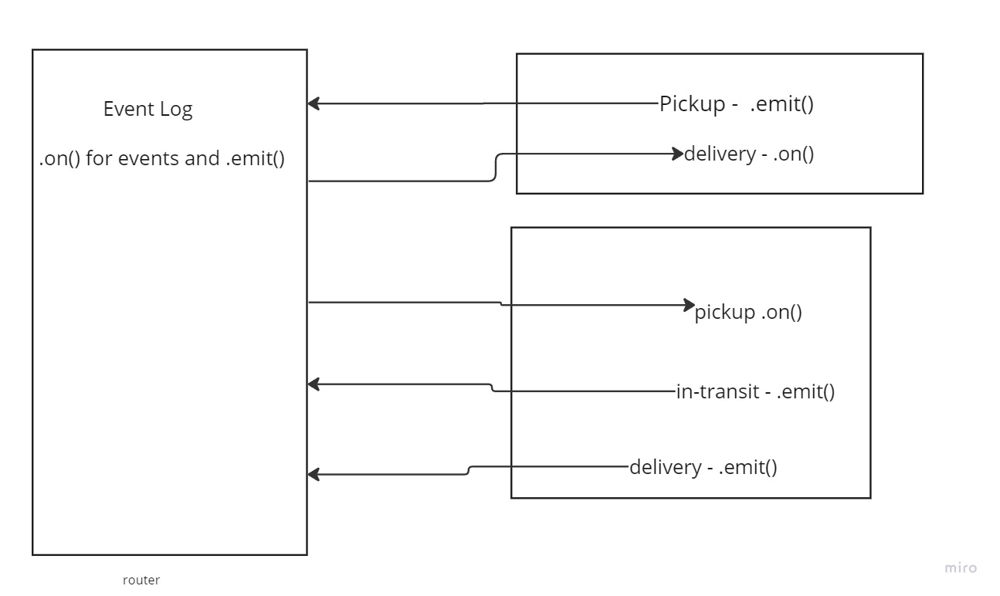

# project lab 14

## Project: Restaurant

### Author: Brenda Jow, Marco Villafana, Jordan Covington

### Problem Domain

Created a Farm -> Butcher -> Restaurant process.

#### `.env` requirements (where applicable)

PORT

#### How to initialize/run your application (where applicable)

`nodemon` & `node index.js` on clients

#### Tests

fill this in as you see fit
- How do you run tests?
nodemon
- Any tests of note?
No
- Describe any tests that you did not complete, skipped, etc
N/A

#### UML

